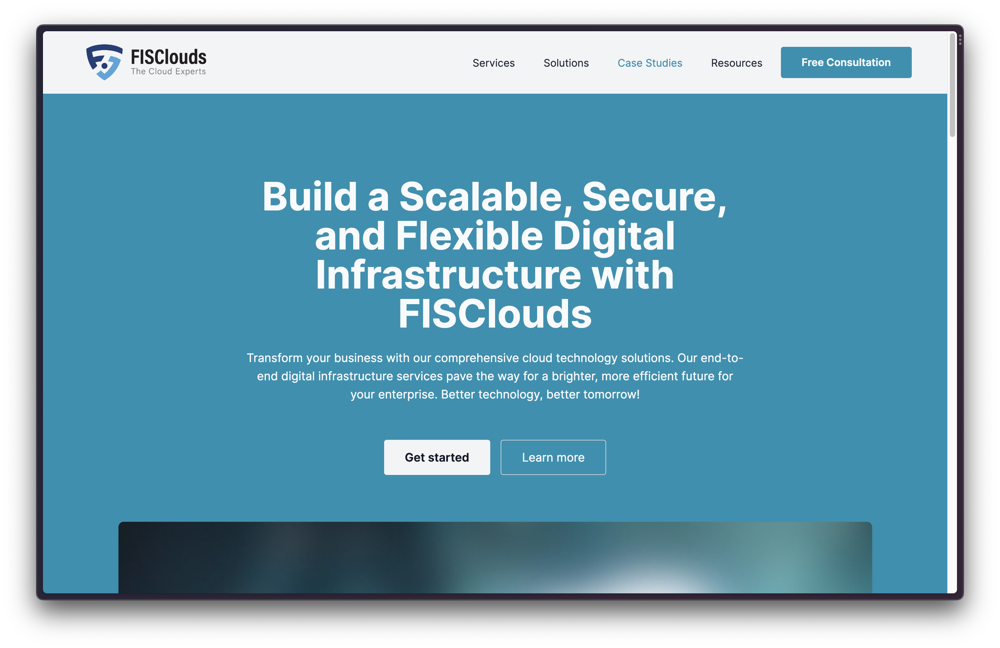
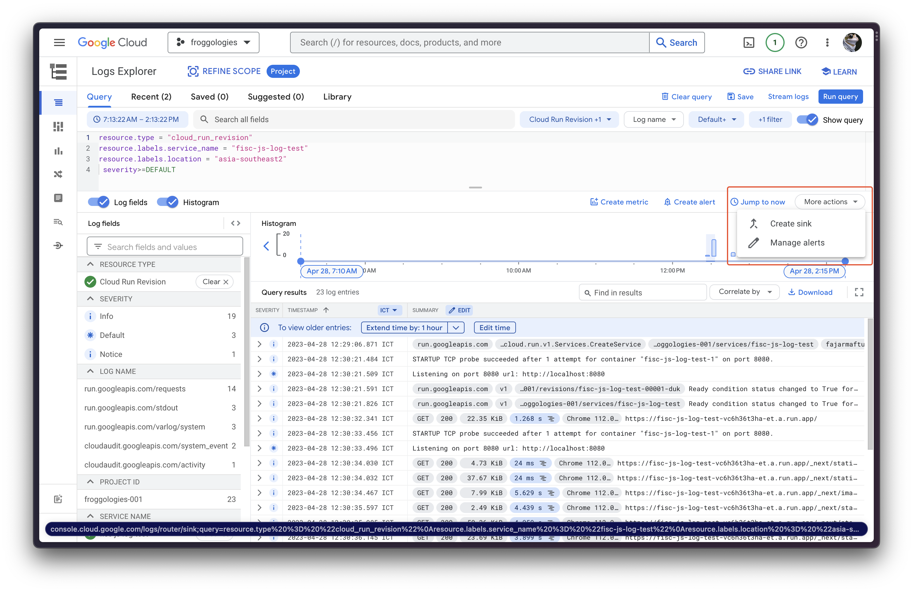
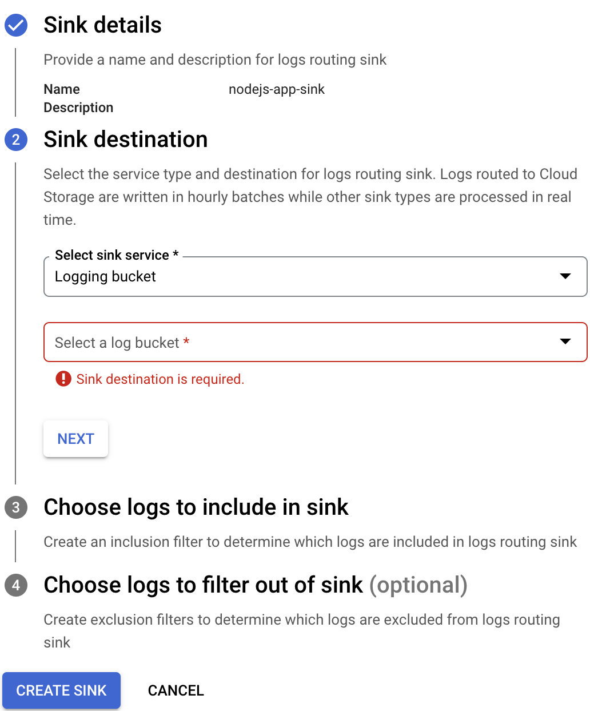
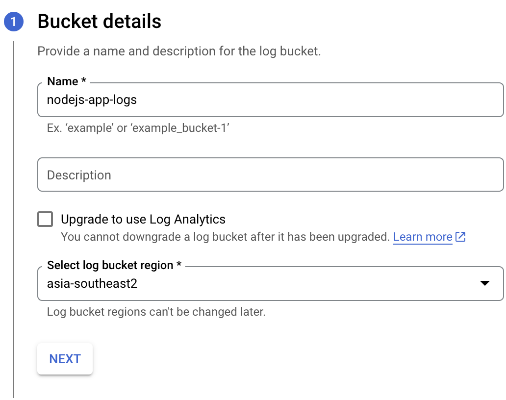
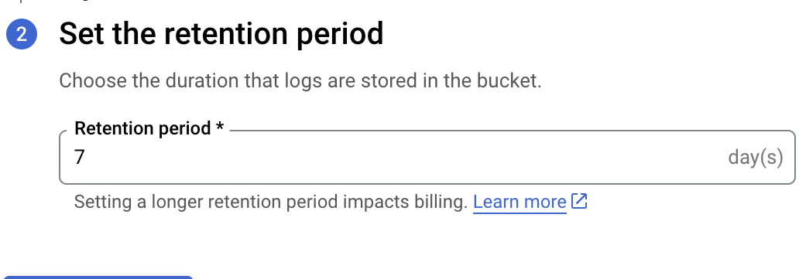
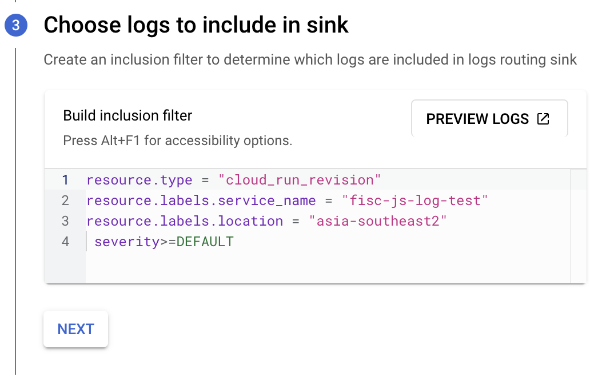
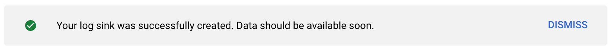
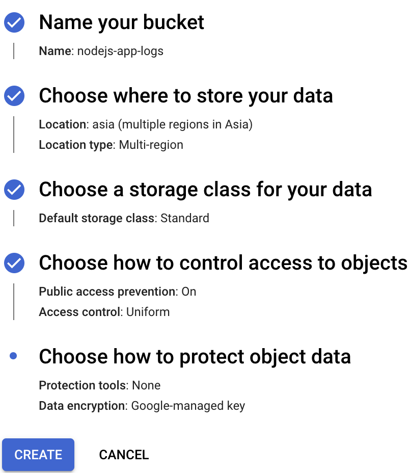
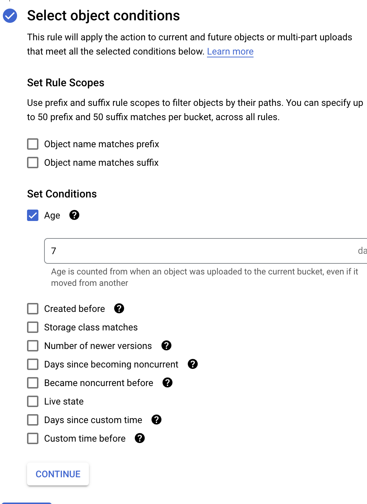
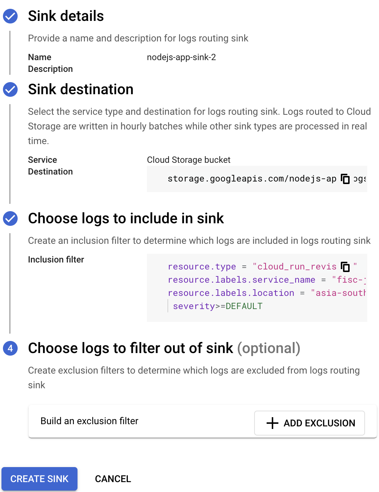

# Demo Logging Node.js Web App on Cloud Run

Welcome to my repository for my demo web application built using Node.js and Next.js as a react framework. This application is containerized using Docker and deployed on Google Cloud Run.



## Description

This project serves as a demonstration on how to capture and store logs generated by a web application built using Node.js and Next.js. The application is served as a container using Docker which makes it easy to deploy and run on any platform. Additionally, the logs generated by the application are also being captured and stored in Google Cloud Storage. The log retention period is set to 1 week which allows users to debug any issues if needed.

## Technologies

- Node.js
- Next.js
- Docker
- Google Cloud Run
- Google Cloud Storage

## Installation

1. Clone the repository:

```
git clone https://github.com/FajarMaftuhFadli/Demo-Logging-Node.js-Web-App-on-Cloud-Run.git
```

2. Build the Docker image:

```
docker build -t nextjs-docker .
```

3. Run the Docker container:

```
docker run -p 3000:3000 nextjs-docker
```

4. Access the web application in a browser:

```
http://localhost:3000
```

## Deployment

Requirment:

- Google Cloud SDK
- Login to GCP Account
- Setup the default project

This application is deployed on Google Cloud Run. To deploy this application on Google Cloud Run, follow the steps below:

1. Build the image in the Cloud Build:

```
gcloud builds submit --tag gcr.io/<project-id>/<image-name>
```

2. Deploy the image to the Cloud Run:

```
gcloud run deploy --image gcr.io/PROJECT-ID/helloworld --platform managed
```

- You will be prompted for the service name: press Enter to accept the default name, `nodejs-web-app`.
- You will be prompted for region: select the region of your choice, for example `asia-southeast2`.
- You will be prompted to allow unauthenticated invocations: respond `y`.

4. Access the web application using the URL generated by Google Cloud Run.

## Logging

The logs generated by this application are captured and stored in Google Cloud Storage. The logs retention period is set to 1 week. To view the logs, access Google Cloud Storage and navigate to the folder where the logs are stored. In here, I provide 2 way to store the logs:

### 1. Logging Bucket

1. Open Cloud Run page in the console
2. Select the service
3. Open the Logs tab
4. View in Logs Explorer
5. Click More actions > Create sink
   
6. Provide the sink name and choose Logging Bucket as the sink service.

   

7. Create new log bucket



8. Set the retention period to 7 days



9. Define the logs filter that will be sinked



10. If everithing is done, click Create Sink



### 2. Cloud Storage

1. First prepare the bucket

   

2. In the bucket list, click the created bucket, Lifecycle > add rule

3. Set the action to Delete object and object condition to Age 7 days

   

4. Define the sink similiar to the first way, choose Cloud Storage Bucket as the Service

   

## Conclusion

This project demonstrates how to capture and store logs generated by a web application built using Node.js and Next.js. The use of Docker and Google Cloud Run makes it easy to deploy and run on any platform, while the logs captured and stored in Google Cloud Storage makes it easy to debug any issues that may arise.

Thank you for visiting my repository.

## Reference

[Next.js with Docker](https://github.com/vercel/next.js/tree/canary/examples/with-docker)
